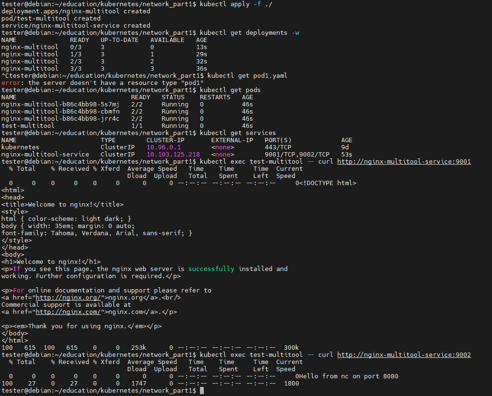
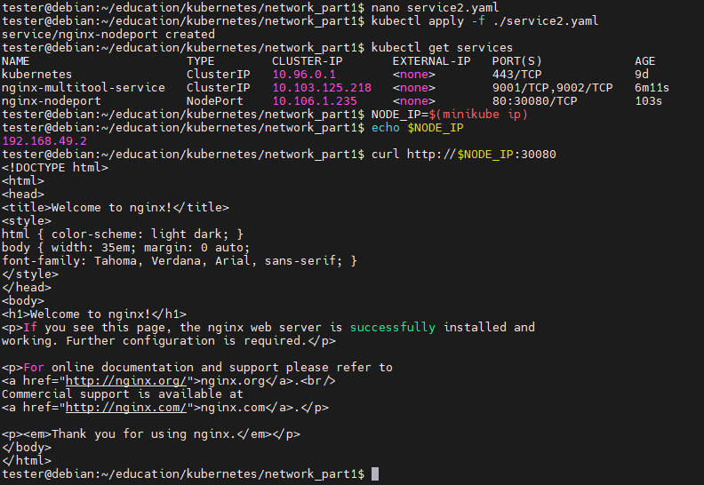

# Домашнее задание к занятию «Сетевое взаимодействие в K8S. Часть 1»

## Описаниее заданий

https://github.com/netology-code/kuber-homeworks/blob/main/1.4/1.4.md

### Цель

В тестовой среде Kubernetes необходимо обеспечить доступ к приложению, установленному в предыдущем ДЗ и состоящему из двух контейнеров, по разным портам в разные контейнеры как внутри кластера, так и снаружи.

------

### Чеклист готовности к домашнему заданию

1. Установленное k8s-решение (например, MicroK8S).
2. Установленный локальный kubectl.
3. Редактор YAML-файлов с подключённым Git-репозиторием.

------

### Инструменты и дополнительные материалы, которые пригодятся для выполнения задания

1. [Описание](https://kubernetes.io/docs/concepts/workloads/controllers/deployment/) Deployment и примеры манифестов.
2. [Описание](https://kubernetes.io/docs/concepts/services-networking/service/) Описание Service.
3. [Описание](https://github.com/wbitt/Network-MultiTool) Multitool.

------

### Задание 1. Создать Deployment и обеспечить доступ к контейнерам приложения по разным портам из другого Pod внутри кластера

1. Создать Deployment приложения, состоящего из двух контейнеров (nginx и multitool), с количеством реплик 3 шт.
2. Создать Service, который обеспечит доступ внутри кластера до контейнеров приложения из п.1 по порту 9001 — nginx 80, по 9002 — multitool 8080.
3. Создать отдельный Pod с приложением multitool и убедиться с помощью `curl`, что из пода есть доступ до приложения из п.1 по разным портам в разные контейнеры.
4. Продемонстрировать доступ с помощью `curl` по доменному имени сервиса.
5. Предоставить манифесты Deployment и Service в решении, а также скриншоты или вывод команды п.4.

------

### Задание 2. Создать Service и обеспечить доступ к приложениям снаружи кластера

1. Создать отдельный Service приложения из Задания 1 с возможностью доступа снаружи кластера к nginx, используя тип NodePort.
2. Продемонстрировать доступ с помощью браузера или `curl` с локального компьютера.
3. Предоставить манифест и Service в решении, а также скриншоты или вывод команды п.2.

------

## Выполнение заданий

### Чек окружения

```
Debian 12 x86_64

minikube - https://minikube.sigs.k8s.io/docs/start/

docker - https://www.docker.com/get-started/

local kubectl - https://kubernetes.io/docs/tasks/tools/install-kubectl-linux/

# docker ready

# install minikube
curl -LO https://storage.googleapis.com/minikube/releases/latest/minikube_latest_amd64.deb
sudo dpkg -i minikube_latest_amd64.deb
minikube start
minikube status

# local kubectl
curl -LO "https://dl.k8s.io/release/$(curl -L -s https://dl.k8s.io/release/stable.txt)/bin/linux/amd64/kubectl"
sudo install -o root -g root -m 0755 kubectl /usr/local/bin/kubectl
kubectl version --client
kubectl get nodes

```

### Решение 1

Создаём deployment1.yaml
```
apiVersion: apps/v1
kind: Deployment
metadata:
  name: nginx-multitool
  labels:
    app: nginx-multitool
spec:
  replicas: 3
  selector:
    matchLabels:
      app: nginx-multitool
  template:
    metadata:
      labels:
        app: nginx-multitool
    spec:
      containers:
      # ---------- nginx ----------
      - name: nginx
        image: nginx:latest
        ports:
        - containerPort: 80
        # Простейший readiness‑probe, чтобы Service отправлял трафик только в готовый контейнер
        readinessProbe:
          httpGet:
            path: /
            port: 80
          initialDelaySeconds: 5
          periodSeconds: 10

      # ---------- network‑multitool ----------
      - name: multitool
        image: wbitt/network-multitool:latest
        # Мы запускаем в контейнере простой HTTP‑сервер, чтобы на порт 8080 можно было «curlить».
        command: ["sh", "-c", "while true; do echo -e \"HTTP/1.1 200 OK\\r\\nContent-Type: text/plain\\r\\n\\r\\nHello from nc on port 8080\" | nc -l -p 8080; done"]
        ports:
        - containerPort: 8080
        readinessProbe:
          tcpSocket:
            port: 8080
          initialDelaySeconds: 5
          periodSeconds: 10
```
Создаём service внутри кластера (ClusterIP) через описание в service1.yaml
```
apiVersion: v1
kind: Service
metadata:
  name: nginx-multitool-service
spec:
  selector:
    app: nginx-multitool
  ports:
  # 9001 → nginx:80
  - name: nginx-http
    protocol: TCP
    port: 9001          # порт, по которому будет обращаться клиент внутри кластера
    targetPort: 80      # порт контейнера nginx
  # 9002 → multitool:8080
  - name: multitool-http
    protocol: TCP
    port: 9002
    targetPort: 8080
  # тип по‑умолчанию = ClusterIP → доступ только изнутри кластера
```
Создаём тест‑pod с multitool через pod1.yaml
```
apiVersion: v1
kind: Pod
metadata:
  name: test-multitool
  labels:
    purpose: network-test
spec:
  restartPolicy: Never
  containers:
  - name: multitool
    image: wbitt/network-multitool:latest
    command: ["sh", "-c", "sleep infinity"]
```
Запускаем всё
```
kubectl apply -f ./
```
Проверяем наличие нужных объектов
```
kubectl get deployments
kubectl get pods
kubectl get services
```
Проверяем доступность приложений из тестового пода
```
kubectl exec test-multitool -- curl http://nginx-multitool-service:9001
kubectl exec test-multitool -- curl http://nginx-multitool-service:9002
```



### Решение 2

Создаём service наружу (NodePort) через описание в service2.yaml
```
apiVersion: v1
kind: Service
metadata:
  name: nginx-nodeport
spec:
  type: NodePort
  selector:
    app: nginx-multitool
  ports:
  - name: http
    protocol: TCP
    port: 80                    # «внутренний» порт сервиса (как у nginx)
    targetPort: 80
    nodePort: 30080            # любой свободный порт в диапазоне 30000‑32767
```
Запускаем его
```
kubectl apply -f ./service2.yaml
```
Проверяем запущенность и работу
```
kubectl get services
NODE_IP=$(minikube ip)
curl http://$NODE_IP:30080
```


Чистим всё
```
kubectl delete -f ./
```